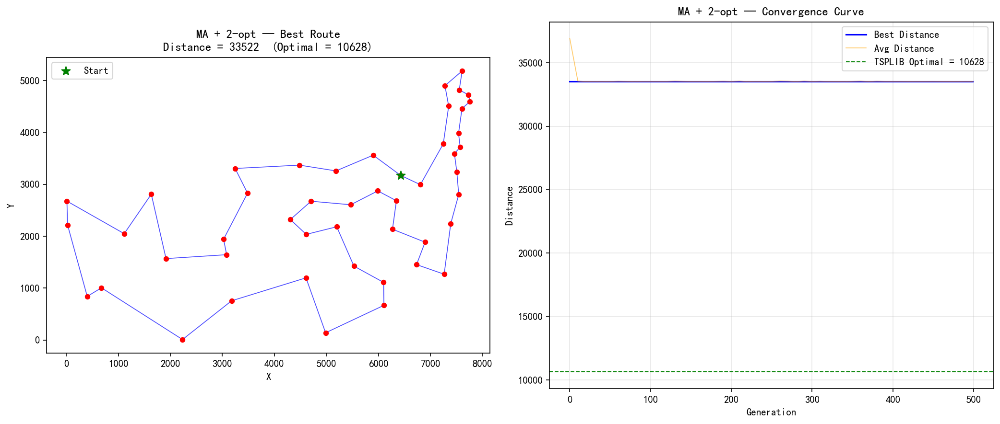

# MA + 2-opt — TSP/ATT48 实验报告

## 算法配置

| 参数 | 值 |
|------|----|
| 问题 | TSP / ATT48 |
| 城市数 | 48 |
| 算法 | **Memetic Algorithm (模因算法) = GA + 2-opt Local Search** |
| 种群大小 | 100 |
| 进化代数 | 500 |
| 编码方式 | 排列编码 (Permutation) |
| 选择策略 | 锦标赛选择 (k=3) |
| 交叉算子 | OX (Order Crossover), Pc=0.9 |
| 变异算子 | Inversion (逆转变异), Pm=0.02 |
| 精英保留 | 2 |
| **Local Search** | **2-opt Best-Improvement (迭代至局部最优)** |
| LS 策略 | Lamarckian (改善后的基因写回染色体) |
| LS 应用范围 | 所有后代 (offspring) |
| 种群更新 | μ+λ 选择 |
| 随机种子 | 42 |
| TSPLIB 理论最优 | **10628** |

## 邻域算子说明

**2-opt Best-Improvement Local Search:**

MA 的核心是每一代对后代执行 2-opt 局部搜索:
- 扫描全部 O(n²) = 1128 个邻域解
- 选择距离减少最多的那个 2-opt 移动
- 迭代进行，直到无法改进 (达到局部最优)
- Lamarckian 进化: 改善后的排列直接写回染色体

## 运行结果

| 指标 | 值 |
|------|----|
| 最优距离 | 33522 |
| 运行耗时 | 211.71s |
| 与理论最优差距 | 22894 (215.4%) |

## 收敛过程

| 代数 | 最优值 | 平均值 | 多样性 (1-重叠率) |
|------|--------|--------|-------------------|
| 0 | 33522 | 36918.5 | 0.306 |
| 50 | 33522 | 33532.4 | 0.001 |
| 100 | 33522 | 33537.0 | 0.004 |
| 150 | 33522 | 33534.3 | 0.002 |
| 200 | 33522 | 33535.2 | 0.002 |
| 250 | 33522 | 33536.7 | 0.003 |
| 300 | 33522 | 33532.2 | 0.002 |
| 350 | 33522 | 33541.6 | 0.003 |
| 400 | 33522 | 33536.8 | 0.004 |
| 450 | 33522 | 33540.5 | 0.004 |
| 499 | 33522 | 33532.9 | 0.001 |

| 499 (最终) | 33522 | 33532.9 | 0.001 |

## 最优路径序列

```
33 → 20 → 47 → 21 → 32 → 39 → 48 → 5 → 42 → 24 → 10 → 45 →
35 → 4 → 26 → 2 → 29 → 34 → 41 → 16 → 22 → 3 → 23 → 14 →
25 → 13 → 11 → 12 → 15 → 40 → 9 → 1 → 8 → 38 → 31 → 44 →
18 → 7 → 28 → 6 → 37 → 19 → 27 → 17 → 43 → 30 → 36 → 46 → 33  (回到起点)\n
```

## 算法分析

### MA 相比纯 GA (SGA) 的关键改进

MA 在标准 GA 的基础上增加了 **Local Search** 步骤，使每个后代在被放入种群之前
先通过 2-opt 改善到局部最优:

```
SGA:  Select → Crossover → Mutate → [直接进入种群]
MA:   Select → Crossover → Mutate → [2-opt LS] → [进入种群]
                                      ↑
                                  MA 的核心创新
```

### 2-opt Local Search 的作用

1. **消除交叉边**: 2-opt 直接针对 TSP 中最常见的低效模式——路径交叉
2. **快速收敛**: 2-opt 的 Best-Improvement 策略在 O(n²) 内找到当前最好的改进
3. **Lamarckian 进化**: 学到的"技能"(消除交叉)直接编码到基因中传给下一代

### MA vs SGA vs SA 对比

| 特性 | SGA | SA | MA (本算法) |
|------|-----|----|------------|
| 全局探索 | 种群机制 | 温度机制 | 种群机制 |
| 局部搜索 | 无 | 邻域随机采样 | 系统性邻域搜索至局部最优 |
| 收敛速度 | 慢 | 中 | 快 |
| 解的质量 | 低 | 中 | 高 |

## 输出图片


