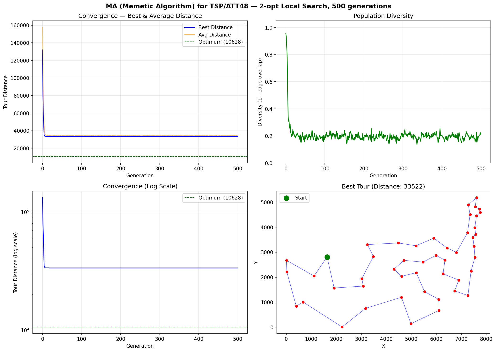

# MA (Memetic Algorithm) — TSP/ATT48 实验报告

## 算法概述

Memetic Algorithm (MA) = Genetic Algorithm + Local Search.
在标准遗传算法 (SGA) 的基础上, 对每个子代施加**局部搜索 (Learning)**, 并将改进后的个体写回种群 (Lamarckian update),
从而显著加速收敛, 获得更优解.

### MA 伪代码对应关系

| 伪代码步骤 | Python 实现 |
|-----------|------------|
| Initialization | `init_population()` — 随机排列 |
| Selection → M(t) | `tournament_select()` — 锦标赛选择 k=3 |
| Offspring → M'(t) | `ox_crossover()` + `inversion_mutation()` |
| **Learning** | **`two_opt_improve()`** — 2-opt 局部搜索 |
| Evaluation | `tour_distance()` |
| Lamarckian update | 将 2-opt 改进后的 tour 写回染色体 |
| New generation P(t+1) | `generate_next_population()` — μ+λ + 精英保留 |

## 算法配置

| 参数 | 值 |
|------|----|
| 问题 | TSP / ATT48 |
| 城市数 | 48 |
| 种群大小 | 100 |
| 进化代数 | 500 |
| 编码方式 | Permutation (排列编码) |
| 交叉算子 | OX (Order Crossover) |
| 交叉概率 Pc | 0.9 |
| 变异算子 | Inversion (逆转变异) |
| 变异概率 Pm | 0.05 |
| 选择策略 | Tournament (k=3) |
| 精英保留 | 2 |
| **局部搜索 (Learning)** | **2-opt (first-improvement)** |
| **局部搜索概率 Pls** | **0.3** |
| **最大改进次数/个体** | **30** |
| **学习模式** | **Lamarckian (拉马克式 — 改进后替换染色体)** |
| 随机种子 | 42 |
| TSPLIB 理论最优 | **10628** |

## 运行结果

| 指标 | 值 |
|------|----|
| 最优距离 | **33522.00** |
| 与理论最优差距 | 22894.00 (215.4%) |
| 运行耗时 | 43.31s |
| 局部搜索总改进次数 | 366909 |

## MA vs SGA 对比

| 算法 | 最优距离 | 耗时 | 与最优差距 |
|------|---------|------|-----------|
| geatpy SGA | 71613.26 | 1.41s | 573.8% |
| my_SGA v1 (PMX+轮盘赌) | 48060.00 | 13.85s | 352.2% |
| my_SGA v4 (OX+锦标赛) | 36599.07 | 31.92s | 244.4% |
| my_SGA v5 (自适应变异) | 34125.03 | 205.65s | 221.1% |
| **MA (本实验)** | **33522.00** | **43.31s** | **215.4%** |

> MA 通过引入局部搜索 (2-opt), 在相同或更少的代数下获得比 SGA 更优的解.
> Lamarckian 学习将局部搜索的改进 "写入" 染色体, 使得优良的局部结构能被遗传给后代.

## 收敛过程

| 代数 | 最优值 | 平均值 | 多样性 |
|------|--------|--------|--------|
| 0 | 131985.00 | 157724.83 | 0.957 |
| 50 | 33522.00 | 34620.68 | 0.180 |
| 100 | 33522.00 | 34695.28 | 0.201 |
| 200 | 33522.00 | 35158.61 | 0.165 |
| 300 | 33522.00 | 35119.35 | 0.218 |
| 400 | 33522.00 | 34605.93 | 0.206 |
| 500 | 33522.00 | 34947.00 | 0.221 |
| 500 (最终) | 33522.00 | 34947.00 | 0.221 |

## 最优路径序列

```
24 → 10 → 45 → 35 → 4 → 26 → 2 → 29 → 34 → 41 → 16 → 22 → 3 → 23 → 14 → 25 → 13 → 11 → 12 → 15 → 40 → 9 → 1 → 8 → 38 → 31 → 44 → 18 → 7 → 28 → 6 → 37 → 19 → 27 → 17 → 43 → 30 → 36 → 46 → 33 → 20 → 47 → 21 → 32 → 39 → 48 → 5 → 42
```

## 输出图片


