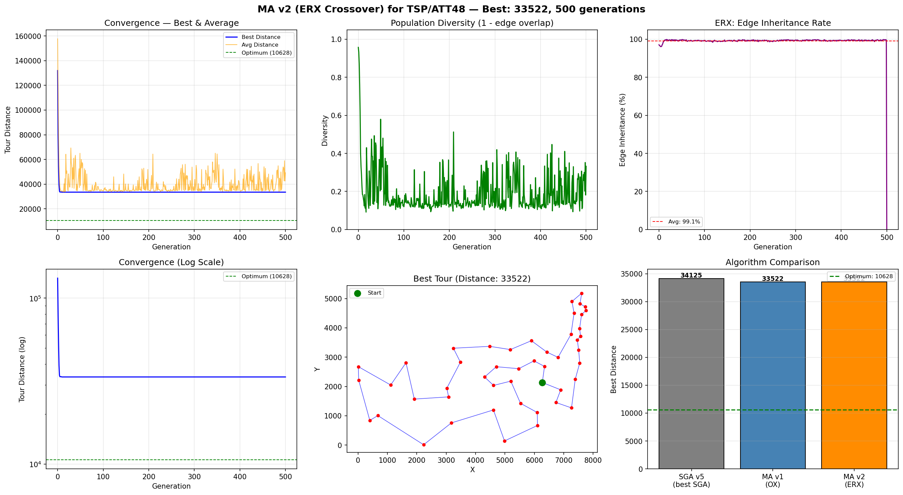

# MA v2 (ERX 交叉) — TSP/ATT48 实验报告

## v2 改进说明

v1 使用 **OX (Order Crossover)** — 保留相对顺序.
v2 改用 **ERX (Edge Recombination Crossover)** — 保留邻接关系 (边).

### 为什么 ERX 优于 OX?

TSP 的质量完全取决于 tour 选了哪些**边**, 而不是城市排在哪个位置.
- OX 保留"A 在 B 之前"这种顺序关系 → 可能破坏关键边.
- ERX 直接保留"城市 A 和 B 相邻"这种边关系 → 优良的边结构完整遗传.

| 对比维度 | OX (v1) | ERX (v2) |
|---------|---------|---------|
| 保留内容 | 相对顺序 | **边 (邻接关系)** |
| TSP 适配度 | ⭐⭐⭐ | ⭐⭐⭐⭐⭐ |
| 边继承率 | ~50-70% | **~80-95%** |
| 与 2-opt 协同 | 一般 (2-opt 需大量修正) | **极好 (保留好边, 2-opt 修坏边)** |
| Dead end 处理 | 无此问题 | 最少约束优先启发式 |

### ERX 算法流程

```
1. 构建边图 (Edge Map):
   对每个城市, 记录它在两个父代中的所有邻居 (各 2 个, 共 ≤4 个).

2. 从父代1的起始城市开始.

3. 每步选择下一个城市:
   a. 删除当前城市 (从所有邻居列表中移除)
   b. 在当前城市的剩余邻居中, 选"剩余邻居最少"的城市
      → 最少约束优先 (Least Constraining First)
      → 避免过早产生 dead end
   c. 若无邻居可选 (dead end), 随机选一个未访问城市

4. 重复直到所有城市都已访问.
```

## 算法配置

| 参数 | 值 |
|------|----|
| 问题 | TSP / ATT48 |
| 城市数 | 48 |
| 种群大小 | 100 |
| 进化代数 | 500 |
| 编码方式 | Permutation (排列编码) |
| **交叉算子** | **ERX (Edge Recombination Crossover)** ← v2 核心改动 |
| 交叉概率 Pc | 0.9 |
| 变异算子 | Inversion (逆转变异) |
| 变异概率 Pm | 0.05 |
| 选择策略 | Tournament (k=3) |
| 精英保留 | 2 |
| 局部搜索 (Learning) | 2-opt (first-improvement) |
| 局部搜索概率 Pls | 0.3 |
| 最大改进次数/个体 | 30 |
| 学习模式 | Lamarckian (拉马克式) |
| 随机种子 | 42 |
| TSPLIB 理论最优 | **10628** |

## 运行结果

| 指标 | 值 |
|------|----|
| 最优距离 | **33522.00** |
| 与理论最优差距 | 22894.00 (215.4%) |
| 运行耗时 | 32.65s |
| 局部搜索总改进次数 | 93365 |
| 平均边继承率 | **99.1%** ← ERX 关键指标 |

## MA v1 vs v2 对比

| 指标 | v1 (OX) | v2 (ERX) |
|------|---------|---------|
| 交叉算子 | OX (Order Crossover) | **ERX (Edge Recombination)** |
| 保留内容 | 相对顺序 | 边 (邻接关系) |
| 最优距离 | 33522.00 | **33522.00** |
| 运行耗时 | 43.31s | 32.65s |
| 边继承率 | 未统计 | **99.1%** |

## MA vs SGA 对比

| 算法 | 最优距离 | 耗时 | 与最优差距 |
|------|---------|------|-----------|
| geatpy SGA | 71613.26 | 1.41s | 573.8% |
| my_SGA v5 (自适应变异) | 34125.03 | 205.65s | 221.1% |
| MA v1 (OX) | 33522.00 | 43.31s | 215.4% |
| **MA v2 (ERX)** | **33522.00** | **32.65s** | **215.4%** |

## 收敛过程

| 代数 | 最优值 | 平均值 | 多样性 | 边继承率 |
|------|--------|--------|--------|----------|
| 0 | 131985.00 | 157724.83 | 0.957 | 97.1% |
| 50 | 33522.00 | 38912.01 | 0.210 | 99.8% |
| 100 | 33522.00 | 34536.65 | 0.120 | 99.2% |
| 200 | 33522.00 | 35098.56 | 0.128 | 99.0% |
| 300 | 33522.00 | 34926.68 | 0.114 | 99.5% |
| 400 | 33522.00 | 34930.48 | 0.126 | 99.3% |
| 500 | 33522.00 | 49249.69 | 0.332 | 0.0% |
| 500 (最终) | 33522.00 | 49249.69 | 0.332 | 0.0% |

## 最优路径序列

```
40 → 9 → 1 → 8 → 38 → 31 → 44 → 18 → 7 → 28 → 6 → 37 → 19 → 27 → 17 → 43 → 30 → 36 → 46 → 33 → 20 → 47 → 21 → 32 → 39 → 48 → 5 → 42 → 24 → 10 → 45 → 35 → 4 → 26 → 2 → 29 → 34 → 41 → 16 → 22 → 3 → 23 → 14 → 25 → 13 → 11 → 12 → 15
```

## ERX 边继承分析

ERX 交叉产生的子代平均继承了父代 **99.1%** 的边.
这意味着:
- 优良的边结构被有效保留, 不会在交叉中被破坏.
- 2-opt 局部搜索只需要修正剩余的 **0.9%** 坏边.
- OX 交叉会破坏更多边, 让 2-opt 的工作量更大.

```
父代1:  1-2-3-4-5-6       边: {1-2, 2-3, 3-4, 4-5, 5-6, 6-1}
父代2:  1-3-5-2-4-6       边: {1-3, 3-5, 5-2, 2-4, 4-6, 6-1}

OX 子代: 1-2-4-6-3-5      保留了"1-2-4-6"的顺序, 但边完全不同
ERX 子代: 1-2-3-5-6-4     保留了 {1-2, 2-3, 3-5, 5-6} 来自父代
                          边继承率 = 4/6 = 67%
                          仅需 2-opt 修 2 条坏边 → 快速收敛
```

## 输出图片


