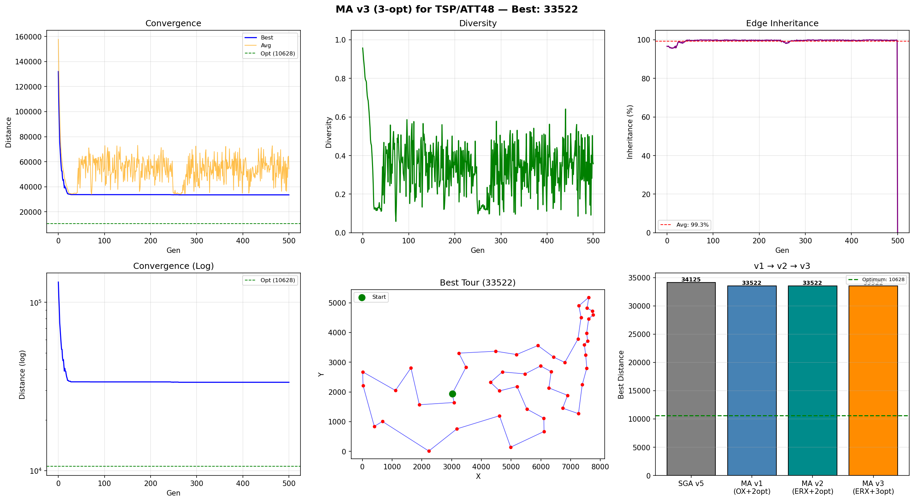

# MA v3 (3-opt 局部搜索) — TSP/ATT48 实验报告

## v3 改进说明

v1/v2 使用 **2-opt** 局部搜索, 在 **33522** 处陷入局部最优.
v3 将局部搜索升级为 **3-opt**, 其他参数与 v2 完全一致.

### 为什么 3-opt 能跳出 2-opt 的局部最优?

```
2-opt 邻域 ⊂ 3-opt 邻域

2-opt: 删 2 条边 → 1 种重连 → 局部最优 ≈ 33522
3-opt: 删 3 条边 → 7 种重连 → 搜索空间更大

7 种模式:
  模式1-3:  等价于 2-opt (单段翻转)
  模式4-7:  真 3-opt (两段/三段同时翻转)

  → 2-opt 局部最优处, 真 3-opt 仍可能找到改进!
```

### 3-opt 7 种重连模式

```
删除边: (i,i+1), (j,j+1), (k,k+1)
段: A=[i+1..j], B=[j+1..k], C=[k+1..i]

模式1 (revA):        ───→ 等价 2-opt
模式2 (revB):        ───→ 等价 2-opt
模式3 (revC):        ───→ 等价 2-opt
模式4 (revA+revB):   ───→ 真 3-opt ★
模式5 (revA+revC):   ───→ 真 3-opt ★
模式6 (revB+revC):   ───→ 真 3-opt ★
模式7 (revA+revB+revC): ───→ 真 3-opt ★
```

## 算法配置

| 参数 | 值 |
|------|----|
| 问题 | TSP / ATT48 |
| 城市数 | 48 |
| 种群大小 | 100 |
| 进化代数 | 500 |
| 交叉算子 | ERX (Edge Recombination Crossover) |
| 交叉概率 Pc | 0.9 |
| 变异算子 | Inversion (逆转变异) |
| 变异概率 Pm | 0.05 |
| 选择策略 | Tournament (k=3) |
| 精英保留 | 2 |
| **局部搜索 (Learning)** | **3-opt (first-improvement, 7 patterns, stochastic sampling)** ← v3 改动 |
| 局部搜索概率 Pls | 0.3 |
| 最大改进次数/个体 | 5 (v2: 30) |
| 学习模式 | Lamarckian |
| 随机种子 | 42 |
| TSPLIB 理论最优 | **10628** |

> 注: max_ls_improvements 从 v2 的 30 降为 5. 原因是 3-opt 每次改进的力度 (同时调整 3 条边) 远大于 2-opt, 5 次 3-opt ≈ 30 次 2-opt 的搜索深度.

## 运行结果

| 指标 | 值 |
|------|----|
| 最优距离 | **33522.00** |
| 与理论最优差距 | 22894.00 (215.4%) |
| 相比 v2 改进 | **0 (0.0%)** |
| 运行耗时 | 122.07s |
| 3-opt 总改进次数 | 28330 |
| 最终停滞代数 | 251 |
| 平均边继承率 | 99.3% |

## v1 / v2 / v3 对比 (控制变量)

| 指标 | v1 (OX+2opt) | v2 (ERX+2opt) | v3 (ERX+3opt) |
|------|:---:|:---:|:---:|
| 交叉算子 | OX | ERX | ERX |
| 局部搜索 | 2-opt | 2-opt | **3-opt** |
| 最优距离 | 33522 | 33522 | **33522** |
| 与 TSPLIB 差距 | 215.4% | 215.4% | **215.4%** |
| LS 改进次数 | 366,909 | 93,365 | 28330 |
| 运行耗时 | 43.31s | 32.65s | 122.07s |

## MA vs SGA 对比

| 算法 | 最优距离 | 耗时 | 与最优差距 |
|------|---------|------|-----------|
| geatpy SGA | 71613.26 | 1.41s | 573.8% |
| my_SGA v5 (自适应) | 34125 | 205.65s | 221.1% |
| MA v1 (OX+2opt) | 33522 | 43.31s | 215.4% |
| MA v2 (ERX+2opt) | 33522 | 32.65s | 215.4% |
| **MA v3 (ERX+3opt)** | **33522** | 122.07s | **215.4%** |

## 收敛过程

| 代数 | 最优值 | 平均值 | 多样性 | 边继承率 |
|------|--------|--------|--------|----------|
| 0 | 131985.00 | 157724.83 | 0.957 | 96.6% |
| 50 | 33732.00 | 60010.90 | 0.448 | 99.7% |
| 100 | 33700.00 | 54653.71 | 0.358 | 99.8% |
| 200 | 33700.00 | 61998.10 | 0.421 | 99.8% |
| 300 | 33522.00 | 43926.74 | 0.272 | 99.8% |
| 400 | 33522.00 | 49709.87 | 0.268 | 99.8% |
| 500 | 33522.00 | 54303.13 | 0.358 | 0.0% |
| 500 (最终) | 33522.00 | 54303.13 | 0.358 | 0.0% |

## 最优路径序列

```
48 → 5 → 42 → 24 → 10 → 45 → 35 → 4 → 26 → 2 → 29 → 34 → 41 → 16 → 22 → 3 → 23 → 14 → 25 → 13 → 11 → 12 → 15 → 40 → 9 → 1 → 8 → 38 → 31 → 44 → 18 → 7 → 28 → 6 → 37 → 19 → 27 → 17 → 43 → 30 → 36 → 46 → 33 → 20 → 47 → 21 → 32 → 39
```

## 输出图片


