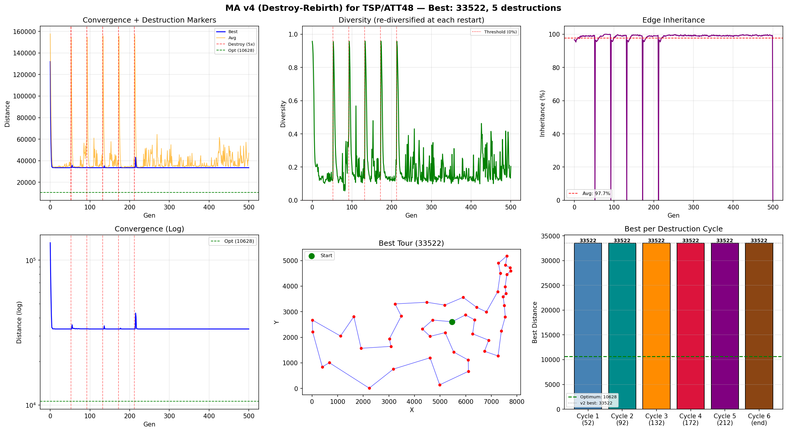

# MA v4 (毁灭-重生) — TSP/ATT48 实验报告

## v4 改进说明

v1-v3 的共同问题: 种群在 ~50 代就收敛到局部最优 33522, 剩余 **90% 的计算资源全部浪费**.
v4 引入**毁灭-重生机制**: 检测到停滞 → 保留精英 → 其余个体随机化 → 重新进化.

### 毁灭-重生原理

```
传统 MA:  收敛 → 空转 450 代 → 输出
v4 MA:   收敛 → [毁灭] → 收敛 → [毁灭] → 收敛 → 输出 min(所有周期)
                ↓              ↓
           随机化 98 个体   随机化 98 个体
           (跳出盆地 #1)    (跳出盆地 #2)
```

### 触发条件 (AND 逻辑)

1. **停滞 ≥ 40 代** — 全局最优无变化
2. **多样性 < 0%** — 种群已趋同, 交叉失效

### 毁灭操作

- **保留**: 2 个精英个体 (不丢失已找到的最优解)
- **随机化**: 其余 98 个个体完全随机生成
- **上限**: 最多 5 次毁灭

## 算法配置

| 参数 | 值 |
|------|----|
| 问题 | TSP / ATT48 |
| 城市数 | 48 |
| 种群大小 | 100 |
| 进化代数 | 500 |
| 交叉算子 | ERX (Edge Recombination Crossover) |
| 交叉概率 Pc | 0.9 |
| 变异算子 | Inversion (逆转变异) |
| 变异概率 Pm | 0.05 |
| 选择策略 | Tournament (k=3) |
| 局部搜索 | 2-opt (first-improvement) |
| Pls / 最大改进数 | 0.3 / 30 |
| **停滞触发阈值** | **40 代** ← v4 新增 |
| **多样性阈值** | **0%** ← v4 新增 |
| **毁灭保留精英** | **2** ← v4 新增 |
| **最大毁灭次数** | **5** ← v4 新增 |
| TSPLIB 理论最优 | **10628** |

## 运行结果

| 指标 | 值 |
|------|----|
| 最优距离 | **33522.00** |
| 与理论最优差距 | 22894.00 (215.4%) |
| 运行耗时 | 33.00s |
| 毁灭次数 | 5 |
| 毁灭发生代数 | [52, 92, 132, 172, 212] |
| 各周期最优 | [33522.0, 33522.0, 33522.0, 33522.0, 33522.0, 33522.0] |
| 2-opt 总改进 | 135477 |
| 平均边继承率 | 97.7% |

## 毁灭-重生周期记录

| 周期 | 毁灭代数 | 毁灭前最优 | 说明 |
|------|---------|-----------|------|
| 1 | 52 | 33522 | 停滞触发 → 毁灭重生 |
| 2 | 92 | 33522 | 停滞触发 → 毁灭重生 |
| 3 | 132 | 33522 | 停滞触发 → 毁灭重生 |
| 4 | 172 | 33522 | 停滞触发 → 毁灭重生 |
| 5 | 212 | 33522 | 停滞触发 → 毁灭重生 |
| 最终 | — | 33522 | 自然结束 (未触发毁灭) |

## v1 → v2 → v3 → v4 对比

| 指标 | v1 (OX+2opt) | v2 (ERX+2opt) | v3 (ERX+3opt) | v4 (ERX+2opt+毁灭) |
|------|:---:|:---:|:---:|:---:|
| 核心策略 | 基础 MA | 优化交叉 | 强化 LS | **多次重启** |
| 最优距离 | 33522 | 33522 | 33522 | **33522** |
| 与 TSPLIB 差距 | 215.4% | 215.4% | 215.4% | **215.4%** |
| 运行耗时 | 43s | 33s | 122s | 33s |
| 毁灭次数 | 0 | 0 | 0 | **5** |

## 收敛过程

| 代数 | 最优值 | 平均值 | 多样性 | 边继承率 | 事件 |
|------|--------|--------|--------|----------|------|
| 0 | 131985.00 | 157724.83 | 0.957 | 96.6% |  |
| 50 | 33522.00 | 39028.78 | 0.124 | 98.8% |  |
| 100 | 33522.00 | 34203.56 | 0.202 | 98.2% |  |
| 200 | 33522.00 | 34585.69 | 0.122 | 99.0% |  |
| 300 | 33522.00 | 34691.70 | 0.115 | 99.5% |  |
| 400 | 33522.00 | 34315.75 | 0.125 | 98.9% |  |
| 500 | 33522.00 | 47101.56 | 0.204 | 0.0% |  |
| 500 (最终) | 33522.00 | 47101.56 | 0.204 | 0.0% | |

## 毁灭-重启可视化说明

收敛曲线图中, **红色虚线**标记毁灭发生的位置.
毁灭后种群平均值会大幅飙升 (因为 98% 个体重新随机化),
随后快速收敛到新的局部最优.

## 最优路径序列

```
11 → 12 → 15 → 40 → 9 → 1 → 8 → 38 → 31 → 44 → 18 → 7 → 28 → 6 → 37 → 19 → 27 → 17 → 43 → 30 → 36 → 46 → 33 → 20 → 47 → 21 → 32 → 39 → 48 → 5 → 42 → 24 → 10 → 45 → 35 → 4 → 26 → 2 → 29 → 34 → 41 → 16 → 22 → 3 → 23 → 14 → 25 → 13
```

## 输出图片


