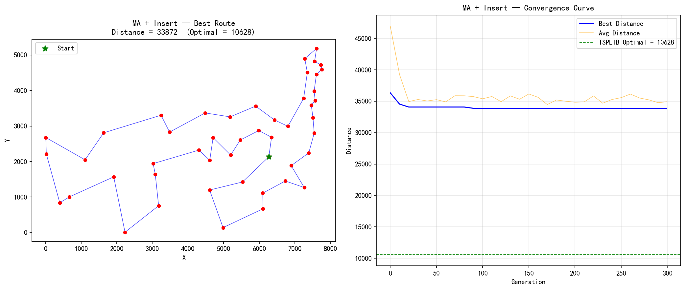

# MA + Insert — TSP/ATT48 实验报告

## 算法配置

| 参数 | 值 |
|------|----|
| 问题 | TSP / ATT48 |
| 城市数 | 48 |
| 算法 | **Memetic Algorithm (模因算法) = GA + Insert Local Search** |
| 种群大小 | 100 |
| 进化代数 | 300 |
| 编码方式 | 排列编码 (Permutation) |
| 选择策略 | 锦标赛选择 (k=3) |
| 交叉算子 | OX (Order Crossover), Pc=0.9 |
| 变异算子 | Inversion (逆转变异), Pm=0.02 |
| 精英保留 | 2 |
| **Local Search** | **Insert First-Improvement (随机采样至局部最优)** |
| LS 策略 | Lamarckian (改善后的基因写回染色体) |
| LS 应用范围 | 所有后代 (offspring) |
| 种群更新 | μ+λ 选择 |
| 随机种子 | 42 |
| TSPLIB 理论最优 | **10628** |

## 邻域算子说明

**Insert First-Improvement Local Search:**

在路径中选取一个城市，将其移动到另一个位置:
- 操作: pop(i) → insert(j)，相当于子路径的旋转
- 改变 3 条边，保持剩余城市的相对顺序
- First-Improvement 策略: 发现第一个改进就接受
- 迭代至无法改进或达到上限 (200)

## 运行结果

| 指标 | 值 |
|------|----|
| 最优距离 | 33872 |
| 运行耗时 | 22.37s |
| 与理论最优差距 | 23244 (218.7%) |

## 收敛过程

| 代数 | 最优值 | 平均值 | 多样性 (1-重叠率) |
|------|--------|--------|-------------------|
| 0 | 36328 | 46919.5 | 0.617 |
| 30 | 34076 | 35274.3 | 0.047 |
| 60 | 34076 | 34897.8 | 0.037 |
| 90 | 33872 | 35733.0 | 0.132 |
| 120 | 33872 | 34926.9 | 0.031 |
| 150 | 33872 | 36153.2 | 0.063 |
| 180 | 33872 | 35196.1 | 0.049 |
| 210 | 33872 | 34894.9 | 0.040 |
| 240 | 33872 | 35270.7 | 0.044 |
| 270 | 33872 | 35509.7 | 0.059 |
| 299 | 33872 | 34911.3 | 0.035 |

| 299 (最终) | 33872 | 34911.3 | 0.035 |

## 最优路径序列

```
40 → 15 → 12 → 11 → 23 → 13 → 14 → 25 → 48 → 5 → 29 → 2 →
42 → 26 → 4 → 35 → 45 → 10 → 24 → 32 → 39 → 21 → 47 → 20 →
33 → 46 → 36 → 30 → 43 → 17 → 27 → 19 → 37 → 6 → 28 → 7 →
18 → 44 → 31 → 38 → 9 → 8 → 1 → 22 → 16 → 41 → 34 → 3 → 40  (回到起点)\n
```

## 算法分析

### MA + Insert 的特点

Insert 算子保持了子路径的相对顺序，适合精细调整:
- 一次 Insert 只改变 3 条边，扰动更加"局部化"
- 邻域大小 = 2256，是所有三种算子中最大的
- 适合在已有较好解的基础上进行微调
- 在 VRP、调度等问题中是比 2-opt 更自然的邻域定义

### 三种 MA 变体的 LS 算子对比

| 特性 | MA + 2-opt | MA + Swap | MA + Insert |
|------|-----------|-----------|-------------|
| LS 搜索策略 | Best-Improvement (全扫描) | First-Improvement | First-Improvement |
| 邻域大小 | 1128 | 1128 | 2256 |
| 改变边数 | 2 | 2~4 | 3 |
| 子路径顺序 | 反转 | 打乱 | 保持(旋转) |
| LS 收敛保证 | 保证局部最优 | 近似 | 近似 |
| TSP 专用性 | ★★★ | ★☆☆ | ★★☆ |

## 输出图片


