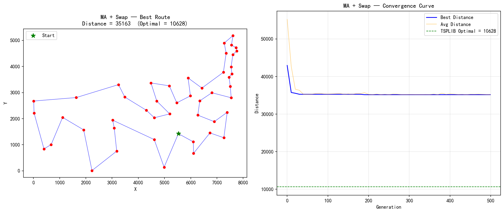

# MA + Swap — TSP/ATT48 实验报告

## 算法配置

| 参数 | 值 |
|------|----|
| 问题 | TSP / ATT48 |
| 城市数 | 48 |
| 算法 | **Memetic Algorithm (模因算法) = GA + Swap Local Search** |
| 种群大小 | 100 |
| 进化代数 | 500 |
| 编码方式 | 排列编码 (Permutation) |
| 选择策略 | 锦标赛选择 (k=3) |
| 交叉算子 | OX (Order Crossover), Pc=0.9 |
| 变异算子 | Inversion (逆转变异), Pm=0.02 |
| 精英保留 | 2 |
| **Local Search** | **Swap First-Improvement (随机采样至局部最优)** |
| LS 策略 | Lamarckian (改善后的基因写回染色体) |
| LS 应用范围 | 所有后代 (offspring) |
| 种群更新 | μ+λ 选择 |
| 随机种子 | 42 |
| TSPLIB 理论最优 | **10628** |

## 邻域算子说明

**Swap First-Improvement Local Search:**

在路径中随机选取两个位置交换城市，接受第一个改进:
- 随机打乱 (i, j) 对的检查顺序
- 发现第一个改进就接受 (First-Improvement)
- 迭代进行，直到无法改进或达到最大迭代次数 (200)
- Lamarckian 进化: 改善后的排列直接写回染色体

## 运行结果

| 指标 | 值 |
|------|----|
| 最优距离 | 35163 |
| 运行耗时 | 49.36s |
| 与理论最优差距 | 24535 (230.9%) |

## 收敛过程

| 代数 | 最优值 | 平均值 | 多样性 (1-重叠率) |
|------|--------|--------|-------------------|
| 0 | 42947 | 55226.4 | 0.677 |
| 50 | 35274 | 35274.0 | 0.000 |
| 100 | 35274 | 35327.6 | 0.000 |
| 150 | 35274 | 35365.9 | 0.001 |
| 200 | 35163 | 35253.1 | 0.001 |
| 250 | 35163 | 35163.0 | 0.000 |
| 300 | 35163 | 35214.0 | 0.001 |
| 350 | 35163 | 35190.2 | 0.001 |
| 400 | 35163 | 35381.9 | 0.003 |
| 450 | 35163 | 35283.6 | 0.001 |
| 499 | 35163 | 35163.0 | 0.000 |

| 499 (最终) | 35163 | 35163.0 | 0.000 |

## 最优路径序列

```
3 → 41 → 34 → 48 → 5 → 29 → 2 → 42 → 10 → 26 → 4 → 35 →
45 → 24 → 32 → 39 → 25 → 14 → 23 → 13 → 21 → 47 → 11 → 12 →
20 → 33 → 36 → 30 → 43 → 17 → 27 → 19 → 37 → 6 → 28 → 7 →
18 → 44 → 31 → 46 → 15 → 40 → 9 → 38 → 8 → 1 → 16 → 22 → 3  (回到起点)\n
```

## 算法分析

### MA + Swap 的特点

Swap 是最通用的排列邻域算子:
- 一次 Swap 改变 2~4 条边，扰动幅度适中
- 邻域大小 = 1128，用 First-Improvement 策略高效搜索
- 适合作为 MA 的"通用型" LS 引擎

### 与 MA + 2-opt 的对比

| 特性 | MA + 2-opt | MA + Swap |
|------|-----------|-----------|
| LS 搜索策略 | Best-Improvement (全扫描) | First-Improvement (随机采样) |
| LS 每次迭代 | 检查全部 1128 个邻域 | 随机采样直到找到改进 |
| LS 收敛保证 | 保证达到局部最优 | 近似局部最优 |
| TSP 专用性 | ★★★ 专用 | ★☆☆ 通用 |

## 输出图片


