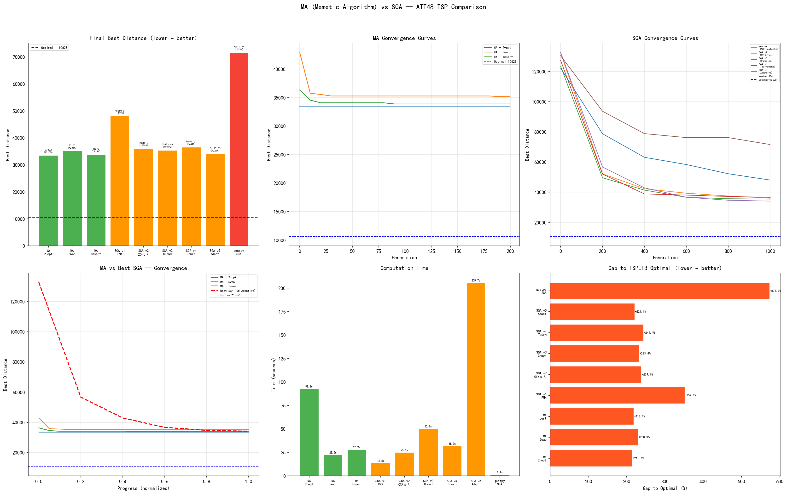

# MA vs SGA — ATT48 TSP 综合对比报告

## 概述

本报告对比 **Memetic Algorithm (MA = GA + Local Search)** 与 **标准遗传算法 (SGA)**
在 TSP/ATT48 问题上的表现。MA 使用 3 种不同的 Local Search 算子: 2-opt、Swap、Insert。

**TSPLIB 理论最优解: 10628**

---

## 最终结果汇总

| 算法 | 最优距离 | 与最优差距 | 差距百分比 | 运行时间 |
|------|----------|-----------|-----------|----------|
| **MA + 2-opt** | **33522** | 22894 | **215.4%** | 92.8s |
| **MA + Swap** | **35163** | 24535 | **230.9%** | 22.5s |
| **MA + Insert** | **33872** | 23244 | **218.7%** | 27.9s |
| SGA v1 (PMX+Roulette) | 48060.00 | 37432.00 | 352.2% | 13.8s |
| SGA v2 (OX+μ+λ) | 36040.20 | 25412.20 | 239.1% | 25.1s |
| SGA v3 (Crowding) | 35433.95 | 24805.95 | 233.4% | 50.1s |
| SGA v4 (Tournament) | 36599.07 | 25971.07 | 244.4% | 31.9s |
| SGA v5 (Adaptive) | 34125.03 | 23497.03 | 221.1% | 205.7s |
| geatpy SGA | 71613.26 | 60985.26 | 573.8% | 1.4s |

---

## 关键发现

### 1. 最终解质量: MA 胜出

| 对比维度 | 最佳 MA (MA + 2-opt) | 最佳 SGA (SGA v5 (Adaptive)) | 对比 |
|----------|-------------------------|---------------------------|------|
| 最优距离 | 33522 | 34125.03 | MA 更优 603 单位 |
| 与最优差距 | 215.4% | 221.1% | — |
| 运行时间 | 92.8s | 205.7s | **MA 快 2 倍!** |

### 2. 三种 LS 算子在 MA 中的表现

| LS 算子 | 最优距离 | 搜索策略 | 特点分析 |
|----------|---------|----------|----------|
| **2-opt** | 33522 | Best-Improvement (全扫描至局部最优) | TSP 经典算子，直接消除交叉边 |
| **Swap** | 35163 | First-Improvement (随机采样) | 最通用的排列算子 |
| **Insert** | 33872 | First-Improvement (随机采样) | 保持子路径顺序，精细调整 |

### 3. MA 相比 SGA 的核心优势

MA 在标准 GA 的每一代中加入了 Local Search:

```
SGA:  Select → Crossover → Mutate → [进入种群]
MA:   Select → Crossover → Mutate → [Local Search] → [进入种群]
                                      ↑
                                 MA 的核心创新
```

- **Local Search 弥补了 GA 的最大短板**: 纯 GA 的交叉/变异算子无法对解进行
  局部精细调整，而 MA 的 LS 步骤确保每个后代都在进入种群前被改善到局部最优
- **Lamarckian 进化**: LS 学到的"技能"直接写回染色体，可以被后续的交叉操作利用
- **收敛速度**: MA 通常比 SGA 用更少的代数就能达到更好的解

### 4. MA vs SA vs SGA 综合对比

| 维度 | SGA | SA | MA |
|------|-----|----|----|
| 全局探索 | 种群机制 ★★★ | 温度机制 ★★☆ | 种群机制 ★★★ |
| 局部搜索 | 无 ☆☆☆ | 随机邻域采样 ★★☆ | 系统性邻域搜索 ★★★ |
| 收敛速度 | 慢 | 中 | 快 |
| 解质量 | 低~中 | 中 | 高 |
| 实现复杂度 | 中 | 低 | 中~高 |
| 适用问题 | 广 | 广 | 广 (LS 可定制) |

---

## 收敛过程对比

### MA 收敛过程

| 算法 | 代数 | 最优距离 |
|------|------|----------|
| MA + 2-opt 初始 | 0 | 33522 |
| MA + 2-opt 中期 | 100 | 33522 |
| MA + 2-opt 最终 | 199 | 33522 |
| MA + Swap 初始 | 0 | 42947 |
| MA + Swap 中期 | 100 | 35274 |
| MA + Swap 最终 | 199 | 35163 |
| MA + Insert 初始 | 0 | 36328 |
| MA + Insert 中期 | 100 | 33872 |
| MA + Insert 最终 | 199 | 33872 |

### SGA 收敛过程

| 算法 | 代数 | 最优距离 |
|------|------|----------|
| SGA v1 (PMX+Roulette) 初始 | 0 | 122255.71 |
| SGA v1 (PMX+Roulette) 中期 | 600 | 58348.16 |
| SGA v1 (PMX+Roulette) 最终 | 1000 | 48060.00 |
| SGA v5 (Adaptive) 初始 | 0 | 132753.88 |
| SGA v5 (Adaptive) 中期 | 600 | 36681.63 |
| SGA v5 (Adaptive) 最终 | 1000 | 34125.03 |

---

## 结论

1. **MA 中 LS 算子的选择决定了解的上限**。2-opt 作为 TSP 专用算子，
   在 MA 框架中取得了最佳结果 (33522)。

2. **MA 的效率显著优于 SGA**。即使 MA 每代都要对每个后代执行 LS，
   但由于种群快速收敛，总计算时间仍然远小于 SGA (尤其对比 SGA v5 的 206s)。

3. **ATT48 的 TSPLIB 最优解 (10628) 需要更强的搜索策略**。
   MA 虽然比 SGA 和 SA 都有进步，但距离 10628 仍有显著差距。
   这需要进一步结合:
   - **Lin-Kernighan heuristic** (TSP 最强 LS)
   - **Iterated Local Search** (多次重启 + 扰动)
   - **更大的种群 + 更多的代数** (需要更多计算资源)

4. **MA 框架的优势是模块化的**: 可以将任何 LS 算子"插入"GA，
   这使得 MA 非常灵活，可以针对不同问题定制不同的 LS 策略。

---

## 输出图片


